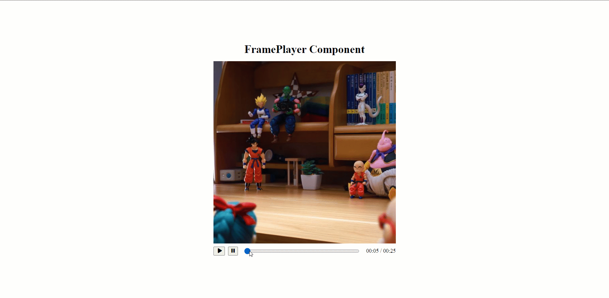

# Prova Técnica FramePlayer

O objetivo dessa prova foi criar um componente React que atue como reprodutor de frames (análogo a um player de vídeo).


## Exemplo de uso:

Em um cenário em que são passados 5 frames com um fps (frames per second) de 0.2, podemos interpretar:

1. Temos 1 frame a cada 5 segundos (fps = 0.2)

2. A duração total é de 25 segundos (5 frames x 5 segundos de intervalo)

3. Se estou no frame 3 o tempo atual é 15s assumindo que usaremos o "tempo final do frame" como referência



## Instalação

```sh
$ npm run setup
```

Você pode conferir o projeto finalizado
[clicando aqui](https://prova-tecnica-frameplayer.surge.sh/).

## Como utilizar

```js
<FramePlayer frames={["imagem1", "imagem2", "imagem3"]} fps={0.2} />
```

## Implementação

| Legenda                       |
| ----------------------------- |
| ✅ Implementado               |
| 🔳 Implementado com ressalvas |
| ⬜ Não implementado           |

O componente em questão deve receber uma array de urls de imagens e o FPS em decimal e a partir disso gerar um "player" com os seguintes recursos:

- ✅ Área de exibição da imagem
- ✅ Botões de play e pause
- ✅ Barra de progresso (com possibilidade de avançar e voltar nos frames / pode ser um slider com 1 "ponto" por frame)
- ✅ Tempo atual (descrito melhor abaixo)

## Versionamento

Usamos [SemVer](http://semver.org/) para versionamento. Para as versões
disponíveis, veja as
[tags neste repositório](https://github.com/inkasadev/prova-tecnica-studiosol/tags).

## Autor

|  |
| :----------------------------------------------------------------------------: |
|               [Phillipe Martins](https://github.com/inkasadev/)                |

## Licença

Este projeto está licenciado sob a Licença MIT - veja o arquivo
[LICENSE.md](LICENSE.md) para detalhes.
